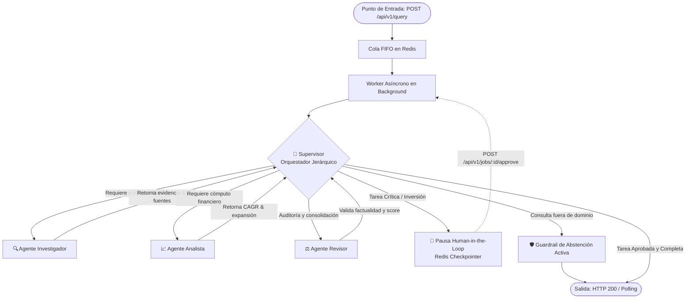

# Sistema Intelligence de Grado de Producción (Capstone Final)

> **The Intelligence System**: Arquitectura desacoplada de Inteligencia Artificial para análisis de mercado e inteligencia corporativa. Integra ingesta documental (RAG híbrido en ChromaDB), orquestación jerárquica multi-agente con ciclos de reflexión (LangGraph con patrón Supervisor), persistencia de estado mediante **Checkpointers durables en Redis**, control de ejecución asíncrono con colas FIFO (FastAPI + Redis), supervisión humana estratégica (**Human-in-the-Loop**), guardrails deterministas de abstención y observabilidad integral con **Arize Phoenix / OpenInference**.

---

## 🧭 1. Resumen Ejecutivo de Arquitectura (Para Ingenieros Senior)

El sistema está diseñado para resolver consultas analíticas y estratégicas complejas mediante una **Arquitectura Desacoplada en 4 Capas** donde cada archivo cumple estrictamente con el principio de responsabilidad única ($< 150$ líneas de código por módulo):

1. **Capa de Ingesta & Recuperación Semántica (RAG)**: Indexa documentos técnicos y de mercado mediante segmentación recursiva (`RecursiveCharacterTextSplitter`), persistencia vectorial local en **ChromaDB** y filtrado estricto por metadatos para minimizar alucinaciones.
2. **Capa Agéntica Jerárquica (LangGraph)**: Un **Supervisor** inteligente rutea dinámicamente hacia tres agentes especialistas (*Investigador RAG*, *Analista Cuantitativo*, *Revisor de Calidad*) coordinados sobre un estado compartido tipado (`IntelligenceState`).
3. **Capa de Persistencia & Resiliencia (Redis)**: Migración integral de la memoria de LangGraph hacia un **`RedisCheckpointer` nativo**. El grafo persiste cada versión de estado, soportando reinicios del servidor, reanudaciones de hilos y pausas por supervisión humana sin pérdida de contexto.
4. **Capa de API & Ejecución Desacoplada (FastAPI + Worker)**: La API recibe la solicitud, encola la tarea en Redis y retorna inmediatamente un ticket (`job_id`, HTTP 202 Accepted). Un **Worker en background** consume las tareas de forma asíncrona y gestiona el ciclo de vida (`pending` ➔ `processing` ➔ `waiting_human_approval` ➔ `completed` / `failed`).
5. **Capa de Observabilidad & AI-Ops (Arize Phoenix)**: Instrumentación continua con **OpenInference / OpenTelemetry** que descompone latencias ($p50$ y $p95$), árbol de spans por agente, consumo de tokens y auditoría FinOps en USD.

---

## 📊 2. Diagrama de Flujo del Grafo Multi-Agente (Mermaid)



---

## 🏗️ 3. Estructura Modular del Repositorio

```text
entrega_final/
├── .env.example                  # Plantilla segura de variables de entorno
├── .gitignore                    # Exclusión de secretos, base de datos y cachés
├── Dockerfile                    # Contenedor optimizado Python 3.12-slim
├── docker-compose.yml            # Orquestador multicontenedor (API + Redis + Phoenix)
├── requirements.txt              # Dependencias completas, fijadas y auditadas
├── run.sh                        # Script de arranque en un solo comando
├── README.md                     # Documentación técnica de arquitectura
├── data/
│   └── knowledge_documents/      # Documentos fuente indexados (IA Market Report 2025)
├── screenshots/                  # Evidencia real de trazas y métricas en Phoenix
│   ├── phoenix_dashboard.png     # Panel general de proyectos
│   ├── phoenix_spans.png         # Árbol jerárquico de spans
│   ├── trace_details.png         # Detalle de ejecución y payloads
│   └── cost_tokens.png           # Métricas FinOps y latencias
├── tests/
│   ├── test_async_integrity.py   # Auditoría estática AST anti-sync
│   ├── test_components.py        # Pruebas unitarias de esquemas y RedisCheckpointer
│   ├── test_api.py               # Pruebas de integración de endpoints FastAPI
│   └── benchmark_suite.py        # Batería oficial de 5 casos + concurrencia
└── app/
    ├── config.py                 # (61 lns) Configuración tipada Pydantic Settings
    ├── main.py                   # (67 lns) Lifespan asíncrono y FastAPI app
    ├── core/
    │   ├── state.py              # (81 lns) IntelligenceState y contratos Pydantic
    │   ├── checkpointer.py       # (124 lns) RedisCheckpointer duradero
    │   └── guardrails.py         # (43 lns) Guardrails de abstención y factualidad
    ├── data/
    │   ├── vectorstore.py        # (75 lns) ChromaDB persistente y búsqueda vectorial
    │   └── ingestion.py          # (60 lns) Pipeline de chunking recursivo e ingesta
    ├── agents/
    │   ├── supervisor.py         # (67 lns) Orquestador con ruteo estructurado
    │   ├── researcher.py         # (45 lns) Agente de investigación RAG
    │   ├── analyst.py            # (52 lns) Agente analista cuantitativo
    │   ├── reviewer.py           # (78 lns) Agente de auditoría y síntesis
    │   └── graph.py              # (69 lns) StateGraph LangGraph con RedisCheckpointer
    ├── tools/
    │   ├── rag_tool.py           # (63 lns) Herramienta de búsqueda documental
    │   └── compute_tool.py       # (36 lns) Herramienta cuantitativa CAGR
    ├── api/
    │   ├── store.py              # (91 lns) Gestor de colas y estados en Redis
    │   ├── worker.py             # (84 lns) Worker en background desacoplado
    │   ├── hitl.py               # (36 lns) Controlador de resolución humana
    │   └── routes.py             # (76 lns) Endpoints REST (/query, /jobs, /approve)
    ├── observability/
    │   ├── tracer.py             # (71 lns) Instrumentación OpenInference / Phoenix
    │   └── finops.py             # (27 lns) Auditoría de tokens y costos en USD
    └── ui/
        ├── index.html            # Consola Web Mission Control interactiva
        └── dashboard.py          # (17 lns) Router para servir la interfaz visual
```

---

## 🚀 4. Guía de Despliegue en Un Solo Comando

El proyecto está preparado para desplegarse de manera limpia e inmediata en cualquier entorno con **Python 3.12+** o **Docker**.

### Opción A: Despliegue con Docker Compose (Recomendado)

```bash
# 1. Clonar y posicionarse en la carpeta
cd entrega_final

# 2. Configurar variables de entorno
cp .env.example .env

# 3. Levantar la infraestructura completa en segundo plano
docker compose up --build -d
```

### Opción B: Despliegue Automatizado con Script

```bash
./run.sh
```

Una vez iniciado, dispones de los siguientes accesos:
* 🎛️ **Mission Control Dashboard**: `http://localhost:8000/dashboard`
* 📚 **Documentación Interactiva Swagger**: `http://localhost:8000/docs`
* 🔬 **Arize Phoenix Observability**: `http://localhost:6006`

---

## 🧪 5. Batería de Pruebas y Evidencia de Observabilidad

El proyecto incluye una suite exhaustiva de validación:

```bash
# Ejecutar auditoría estática anti-sync y pruebas de componentes
pytest tests/ -v

# Ejecutar la batería oficial de 5 casos de prueba y benchmark concurrente
python -m tests.benchmark_suite
```

### Los 5 Casos de Prueba Oficiales:
1. **Caso 1 — RAG Documental Puro**: Consulta sobre adopción Fortune 500 y conductores de mercado. Recupera y cita evidencias desde ChromaDB.
2. **Caso 2 — Análisis Cuantitativo**: Cálculo de tasa de crecimiento anual compuesta (CAGR) y factor de expansión (19.4x).
3. **Caso 3 — Supervisión Jerárquica Multi-Dominio**: Flujo completo coordinado donde el Supervisor delega secuencialmente a Investigador, Analista y Revisor.
4. **Caso 4 — Human-in-the-Loop Crítico**: Solicitud de decisión de inversión institucional. El grafo se suspende, guarda checkpoint en Redis y espera aprobación humana antes de emitir la síntesis final.
5. **Caso 5 — Guardrail de Factualidad y Abstención**: Pregunta fuera de dominio ("Receta de pasta al pesto"). El sistema detecta la ausencia de fuentes y emite una abstención activa sin alucinaciones.

---

## 🛡️ 6. Cumplimiento del Feedback de la Pre-Entrega 07

1. **Checkpoints en Redis**: A diferencia de la pre-entrega donde se utilizó `MemorySaver()`, en este Capstone se desarrolló la clase `RedisCheckpointer` (en `app/core/checkpointer.py`) que persiste de manera duradera todas las versiones del grafo en Redis (`intelligence_checkpoint:*`).
2. **Entorno y Dependencias Impecables**: El archivo `requirements.txt` contiene explícitamente todas las librerías necesarias (`langgraph`, `langchain-core`, `chromadb`, `httpx`, `pytest`, `arize-phoenix`, etc.) sin recurrir a dependencias transitivas ni generar incompatibilidades en instalaciones limpias sobre Python 3.12.
