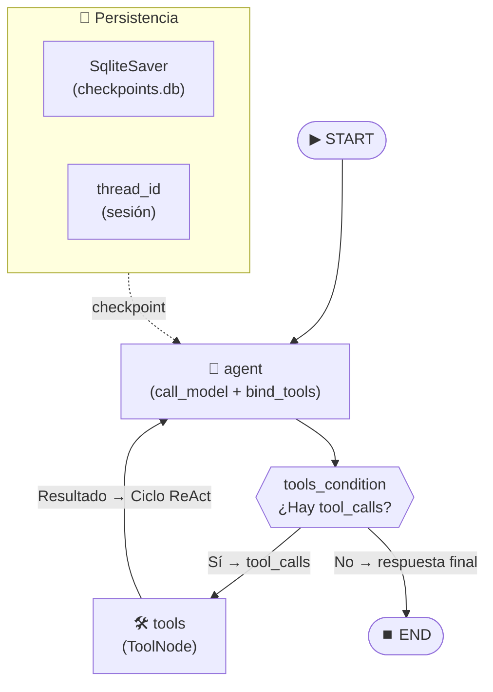

# Pre-entrega 5: Agente de Razonamiento Cíclico con Memoria Persistente

> **AI Engineering • Coderhouse — Módulo 5: Razonamiento Autónomo**

Agente autónomo de gestión comercial construido con **LangGraph** que implementa el patrón **ReAct** (Reason + Act) con ciclos de razonamiento multi-paso y memoria persistente en **SQLite**.

---

## 📁 Estructura del Proyecto

```text
pre_entrega_05/
├── .env.example              # Plantilla segura de variables de entorno
├── .gitignore                # Excluye .env, .venv, checkpoints.db
├── requirements.txt          # Dependencias (langgraph-checkpoint-sqlite, pytest)
├── README.md                 # Este archivo
│
├── tools.py                  # Fase 1: 3 herramientas @tool con docstrings descriptivos
├── graph.py                  # Fase 2: StateGraph (MessagesState) + ciclo ReAct
├── checkpointer.py           # Fase 3: Persistencia con AsyncSqliteSaver (SqliteSaver)
├── main.py                   # Orquestador: ejecución en 4 pasos (incluye Auto-Recuperación)
├── chat.py                   # [NUEVO] Interfaz CLI interactiva con el agente
├── test_agent.py             # [NUEVO] Suite de pruebas automatizadas (pytest)
│
├── traza_ejecucion.json      # [GENERADO] Log del razonamiento ReAct exportado
└── checkpoints.db            # [GENERADO] Base de datos SQLite de persistencia

---

## 🚀 Cómo Levantar el Entorno

### 1. Clonar y configurar el entorno virtual

```bash
cd pre_entrega_05
python3 -m venv .venv
source .venv/bin/activate
pip install -r requirements.txt
```

### 2. Configurar las variables de entorno

```bash
cp .env.example .env
# Editar .env con tu API key real de OpenAI
```

| Variable | Descripción |
| :--- | :--- |
| `OPENAI_API_KEY` | API Key de OpenAI |
| `OPENAI_MODEL` | Modelo a usar (default: `gpt-4o-mini`) |

### 3. Ejecutar el Agente

Puedes probar el agente de tres maneras diferentes:

**A. Demostración Automatizada y Traza JSON:**
```bash
python main.py
```
*(Ejecuta 4 pasos fijos incluyendo auto-recuperación de errores y exporta `traza_ejecucion.json`)*

**B. Chat Interactivo en Terminal:**
```bash
python chat.py
```
*(Conversa libremente con el agente; recuerda el contexto)*

**C. Suite de Pruebas Automatizadas:**
```bash
pytest test_agent.py -v
```
*(Valida la compilación del grafo, herramientas y persistencia)*

---

## 🏗️ Arquitectura del Sistema



### Componentes Clave

| Componente | Archivo | Descripción |
| :--- | :--- | :--- |
| **Herramientas** | `tools.py` | 3 funciones `@tool` que simulan consultas a DB de pedidos, catálogo y envíos |
| **Grafo ReAct** | `graph.py` | `StateGraph(MessagesState)` con arista condicional `tools_condition` |
| **Persistencia** | `checkpointer.py` | `AsyncSqliteSaver` (SqliteSaver) con `checkpoints.db` |
| **Orquestador** | `main.py` | Ejecuta 3 pasos con `thread_id` y exporta traza a JSON |

---

## 🧪 Ejemplo de Traza de Ejecución

```text
=================================================================
🤖 PRE-ENTREGA 5: AGENTE REACT CON SQLITESAVER
=================================================================
Thread ID: sesion_cliente_demo
Recursion Limit: 10

=================================================================
📍 PASO 1
=================================================================
👤 Usuario: ¿Cuántos pedidos tuvo el cliente 102 y cuál fue el total?
   → El agente invoca autónomamente: buscar_pedidos(cliente_id=102)
   → Herramienta retorna: "Cliente 102: 3 pedidos, total $14,500, último pedido #1003"
🤖 Agente: El cliente 102 tuvo un total de 3 pedidos, con un monto total
   facturado de $14,500. El último pedido tiene el ID #1003.
📊 Mensajes acumulados: 4

=================================================================
📍 PASO 2
=================================================================
👤 Usuario: ¿Y cuál fue el último producto que compró? Dame nombre y precio.
   → El agente recuerda el contexto (producto_id=305) y llama:
     consultar_producto(producto_id=305)
   → Herramienta retorna: "Monitor UltraWide 34\", $5,200.00, stock: 8"
🤖 Agente: El último producto fue un Monitor UltraWide 34", con un precio
   de $5,200.00.
📊 Mensajes acumulados: 8

=================================================================
📍 PASO 3
=================================================================
👤 Usuario: ¿En qué estado está el envío de ese pedido?
   → El agente infiere pedido_id=1003 del contexto previo y llama:
     verificar_estado_envio(pedido_id=1003)
   → Herramienta retorna: "En camino, fecha estimada: 2026-08-18"
🤖 Agente: El envío del pedido #1003 está en estado "En camino", con fecha
   estimada de entrega para el 18 de agosto de 2026.
📊 Mensajes acumulados: 12

=================================================================
✅ EJECUCIÓN COMPLETADA
📄 Traza exportada a: traza_ejecucion.json
=================================================================
```

---

## ✅ Checklist de Criterios de Aceptación

| # | Criterio | Estado |
| :-: | :--- | :-: |
| 1 | `StateGraph` hereda de `MessagesState` | ✅ |
| 2 | Al menos 1 herramienta `@tool` con docstring descriptivo | ✅ (3 herramientas) |
| 3 | Persistencia `SqliteSaver` + `thread_id` | ✅ |
| 4 | Razonamiento multi-paso (herramienta invocada ≥2 veces) | ✅ (3 invocaciones) |
| 5 | `recursion_limit` definido | ✅ (10) |
| 6 | Traza `.json` incluida en el repo | ✅ |
| 7 | No hay API keys expuestas | ✅ |
| 8 | Autonomía: sin `if/else` manuales | ✅ (`tools_condition`) |
| 9 | Ciclo de retorno (ReAct loop) | ✅ |
| 10 | Resiliencia de estado (recuerda contexto) | ✅ |

---

## 🔧 Tecnologías Utilizadas

| Componente | Tecnología |
| :--- | :--- |
| Framework de Agentes | LangGraph (`StateGraph`, `MessagesState`) |
| LLM | OpenAI `gpt-4o-mini` |
| Herramientas | LangChain `@tool` + Pydantic |
| Persistencia | `langgraph-checkpoint-sqlite` (SqliteSaver/AsyncSqliteSaver) |
| Async Runtime | Python `asyncio` |
| Gestión de Secretos | `python-dotenv` + `.env` |
