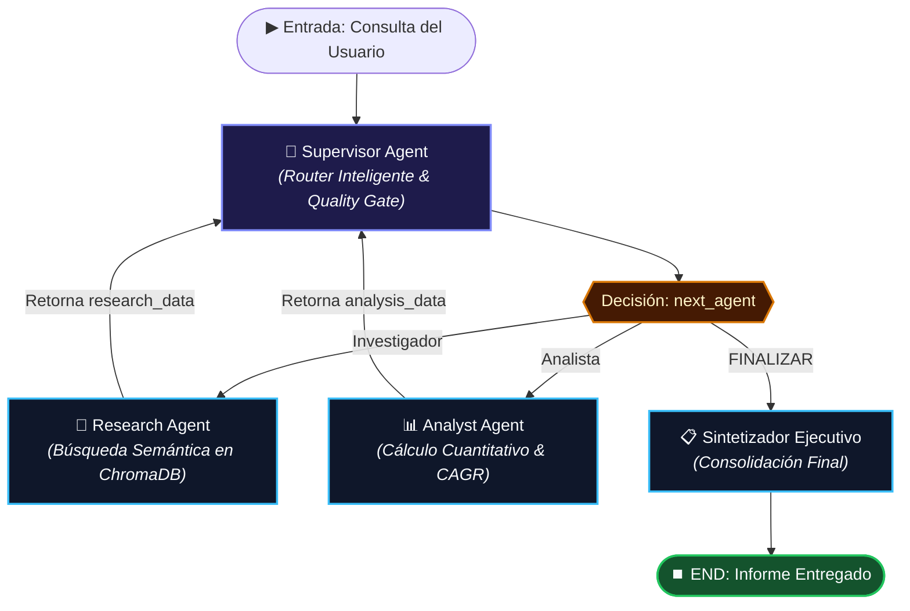

# Pre-Entrega 6: Orquestador Multi-Agente de Análisis e Investigación con ChromaDB

> **Programa:** AI Engineering — Coderhouse  
> **Módulo 6:** Sistemas Multi-Agente: Colaboración y Especialización  
> **Topología:** Jerárquica con Patrón Supervisor en LangGraph  
> **Base Vectorial:** ChromaDB con Embeddings `text-embedding-3-small`  
> **Autor:** Jen Yanez  

---

## 📌 Descripción del Proyecto

Este proyecto implementa un **Orquestador Multi-Agente de Análisis e Investigación** con **topología jerárquica** desarrollado sobre **LangGraph**, **ChromaDB**, **Pydantic V2** y **OpenAI Structured Outputs**.

El sistema procesa consultas complejas desacoplando el flujo en dos dominios de especialización independientes y una fase de síntesis final:
1. **Agente de Investigación:** Realiza **búsqueda semántica vectorial sobre ChromaDB** consultando reportes técnicos y de mercado indexados con embeddings de OpenAI (`text-embedding-3-small`).
2. **Agente de Análisis:** Realiza cómputo matemático riguroso (CAGR, crecimiento porcentual y estadísticas) utilizando herramientas de cálculo determinista.
3. **Supervisor (Orquestador Central):** Actúa como director de tráfico inteligente y compuerta de calidad (*Quality Gate*), evaluando la suficiencia de los datos antes de autorizar la síntesis ejecutiva final.
4. **Sintetizador Ejecutivo:** Consolida los hallazgos en un informe directivo estructurado y fundamentado.

---

## 🗄️ Arquitectura de la Vector DB (ChromaDB)

```text
data/knowledge_documents/          RecursiveCharacterTextSplitter          OpenAIEmbeddings            data/chroma_db/
├── ia_generativa_market_2025.md     ─────────────────────────────►  (text-embedding-3-small) ──►  (Chroma VectorStore)
├── sistemas_multiagente_survey.md             (chunk_size=400)               (1536 dims)             Collection:
└── rag_avanzado_benchmark.md                  (overlap=50)                                       'multiagent_knowledge_base'
```

* **Ingesta:** El script [`ingest.py`](./ingest.py) lee los documentos técnicos, genera 14 fragmentos semánticos, calcula los vectores de embeddings densos y los persiste localmente en `data/chroma_db/`.
* **Retrieval Semántico:** La herramienta [`query_chroma_vector_db`](./tools/search_tools.py) ejecuta búsquedas por similitud de cosenos devolviendo los fragmentos más relevantes y sus metadatos de fuente.

---

## 🏗️ Topología del Grafo y Diagrama de Flujo



---

## 🏛️ Justificación Arquitectónica: ¿Por qué Jerarquía sobre Cooperación?

En sistemas multi-agente empresariales, la topología jerárquica ofrece ventajas deterministas frente a redes cooperativas entre pares (Peer-to-Peer):

| Dimensión Técnica | Topología Cooperativa (P2P / Blackboard) | Topología Jerárquica (Patrón Supervisor) | Justificación en Nuestro Orquestador |
| :--- | :--- | :--- | :--- |
| **1. Determinismo y Secuencia** | Emergente e impredecible; los agentes compiten por el turno. | **Protocolar:** El Supervisor impone el orden lógico (Investigación $\to$ Cómputo $\to$ Síntesis). | No es posible calcular el CAGR antes de extraer las cifras de mercado. |
| **2. Prevención de Bucles Infinitos** | Alto riesgo de ciclos recursivos sin árbitro central. | **Garantizada:** El Supervisor gestiona un contador de iteraciones (`MAX_ITERATIONS = 6`). | Evita consumo descontrolado de tokens y bloqueos del sistema. |
| **3. Aislamiento de Contexto** | Todos los agentes comparten todo el historial, generando ruido. | **Canales Aislados:** Cada agente recibe solo el contexto necesario y escribe en su canal tipado. | Previene contaminación de contexto y alucinaciones de formato. |
| **4. Eficiencia de Costos** | Exige modelos potentes en todos los nodos para autocoordinación. | **Modelos Heterogéneos:** Supervisor focalizado y Workers especializados de bajo costo (`gpt-4o-mini`). | Ahorro superior al 70% en costos de inferencia. |

---

## 🛡️ Manejo de Conflictos y Rúbrica de Suficiencia

* **Rúbrica de Validación del Supervisor:**
  1. ¿Existen datos de investigación válidos en `state['research_data']`? Si no $\to$ Enruta a `Investigador`.
  2. ¿Existen cálculos cuantitativos válidos en `state['analysis_data']`? Si no $\to$ Enruta a `Analista`.
  3. ¿Ambos artefactos están presentes y validados con Pydantic? $\to$ Enruta a `FINALIZAR` $\to$ `Sintetizador`.
* **Guardrail Anti-Loop:** Si el contador de iteraciones alcanza el umbral de seguridad (`MAX_ITERATIONS = 6`), el Supervisor interrumpe el ciclo y procede al cierre para evitar costos desmedidos.
* **Manejo de Excepciones:** Todos los nodos capturan errores en bloques `try/except`, registrando alertas en `state['error']` sin detener el runtime de LangGraph.

---

## 📂 Estructura del Repositorio

```text
pre_entrega_06/
├── .env.example              # Plantilla de variables de entorno
├── .gitignore                # Reglas de exclusión de Git (protección de .env y chroma_db)
├── requirements.txt          # Dependencias (LangGraph, ChromaDB, Pydantic, etc.)
├── state.py                  # Esquemas Pydantic y AgentState compartido
├── ingest.py                 # Script de ingesta, chunking y embeddings en ChromaDB
├── data/
│   ├── knowledge_documents/  # Documentos Markdown reales de investigación
│   └── chroma_db/            # Base de datos vectorial persistente
├── tools/                    # Herramientas funcionales de los agentes
│   ├── __init__.py
│   ├── search_tools.py       # Herramientas de búsqueda semántica en ChromaDB
│   └── analysis_tools.py     # Herramientas matemáticas y CAGR
├── agents/                   # Nodos especialistas y orquestador
│   ├── __init__.py
│   ├── research_agent.py     # Especialista en investigación (ChromaDB)
│   ├── analyst_agent.py      # Especialista en análisis cuantitativo
│   ├── supervisor_agent.py   # Nodo Supervisor con router y rúbrica
│   └── synthesis_agent.py    # Nodo de consolidación ejecutiva
├── graph.py                  # Ensamblado y compilación del StateGraph
├── main.py                   # CLI interactivo con ejecución streaming
├── test_orchestrator.py      # Suite de 10 pruebas automatizadas
├── demo.ipynb                # Notebook interactivo de demostración
└── README.md                 # Documentación técnica completa
```

---

## 🚀 Guía de Instalación y Ejecución

### 1. Configurar Entorno e Ingestar Documentos
```bash
# Copiar variables de entorno
cp .env.example .env

# Ejecutar ingesta y vectorización en ChromaDB
python ingest.py
```

### 2. Ejecutar la Aplicación Interactiva (CLI)
```bash
python main.py
```
O con una consulta personalizada:
```bash
python main.py "Investiga las proyecciones de Sistemas Multi-Agente en ChromaDB y calcula el CAGR estimado"
```

### 3. Ejecutar la Suite de Pruebas Automatizadas
```bash
python test_orchestrator.py
```

### 4. Demostración Interactiva (Jupyter Notebook)
Abre `demo.ipynb` en JupyterLab, VS Code o Google Colab para recorrer el flujo paso a paso con salidas visuales.
