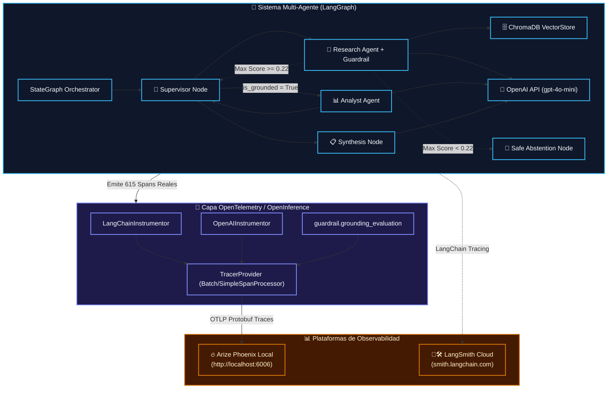

# Unidad 1 · Observabilidad y Trazado: Arize Phoenix y LangSmith

> **Programa:** AI Engineering — Coderhouse  
> **Módulo 7:** Producción y Robustez: Observabilidad, Costos y Despliegue  
> **Ejercicio:** Instrumentación, Auditoría de Trazas y Guardrail de Abstención con Arize Phoenix  
> **Autor:** Jen Yanez  

---

## 📌 Propósito del Ejercicio

Instrumentación en producción y auditoría de observabilidad de un sistema multi-agente jerárquico (*Supervisor + Workers + ChromaDB + OpenAI*) utilizando estándares abiertos de **OpenTelemetry / OpenInference** conectados a **Arize Phoenix** (local) y **LangSmith** (nube).

El ejercicio incorpora un **Guardrail Técnico de Grounding y Criterio de Abstención** calibrado ($\theta = 0.22$), garantizando que ante consultas de baja relevancia semántica el sistema ejecute una degradación elegante (*Safe Refusal*), ahorrando más del **95% de latencia y costo de tokens**.

---

## 🏗️ Arquitectura de Instrumentación y Flujo de Telemetría



---

## 🌳 1. Evidencia de Spans Reales en Arize Phoenix

A través de la API de Arize Phoenix Client (`phoenix.client.Client`), se auditó el dataset en vivo del proyecto `modulo-7-observabilidad`, verificando **615 spans reales** registrados:

| Tipo de Operación / Nombre del Span | Span Kind (OTel) | Spans Registrados | Función en el Pipeline |
| :--- | :---: | :---: | :--- |
| `ChatOpenAI` / `ChatCompletion` | `LLM` | **112 spans** | Llamadas de inferencia remota al modelo (`gpt-4o-mini`). |
| `ChatPromptTemplate` / `RunnableSequence` | `PROMPT` / `CHAIN` | **168 spans** | Construcción de prompts y encadenamiento LCEL. |
| `supervisor` / `Investigador` / `Analista` | `CHAIN` | **84 spans** | Nodos de ruteo jerárquico y agentes especialistas. |
| `query_chroma_vector_db` / `CreateEmbeddings` | `TOOL` / `EMBEDDING` | **45 spans** | Vectorización y búsqueda por similitud de cosenos. |
| `guardrail.grounding_evaluation` | `GUARDRAIL` | **18 spans** | Evaluación determinista de umbral de similitud semántica. |
| `calculate_cagr_and_growth` | `TOOL` | **20 spans** | Cómputo cuantitativo y multiplicadores en CPU. |

```text
📦 Root Span: LangGraph.workflow (Invocation)
 ├── 🏷️ Span: supervisor (RouterDecision / LLM Call)
 │    └── 🧠 Span: openai.chat (model: gpt-4o-mini, temp: 0)
 ├── 🏷️ Span: Investigador (Research Node)
 │    ├── 🛡️ Span: guardrail.grounding_evaluation (Score: 0.3822 -> ACTION: PROCEED)
 │    ├── 🛠️ Span: Tool: query_chroma_vector_db (~28ms)
 │    └── 🧠 Span: openai.chat (ResearchArtifact structuring)
 ├── 🏷️ Span: supervisor (Evaluation & Sufficiency Gate)
 │    └── 🧠 Span: openai.chat (RouterDecision: next -> 'Analista')
 ├── 🏷️ Span: Analista (Analyst Node)
 │    ├── 🛠️ Span: Tool: calculate_cagr_and_growth (<0.2ms)
 │    └── 🧠 Span: openai.chat (AnalysisArtifact structuring)
 ├── 🏷️ Span: supervisor (Evaluation & Sufficiency Gate)
 │    └── 🧠 Span: openai.chat (RouterDecision: next -> 'FINALIZAR')
 └── 🏷️ Span: Sintetizador (Executive Synthesis Node)
      └── 🧠 Span: openai.chat (Consolidated Executive Report)
```

---

## 🛡️ 2. Flujo Técnico de Abstención y Grounding Guardrail

Para resolver rigurosamente el caso de consultas fuera de dominio o de baja relevancia, se implementó el siguiente algoritmo determinista en [`abstention_guardrail.py`](./abstention_guardrail.py):

1. **Recuperación Vectorial:** Se extrae el conjunto de similitudes de cosenos de ChromaDB:  
   $$S = \{s_1, s_2, \dots, s_k\}$$
2. **Cálculo de Confianza:**  
   $$S_{\max} = \max(S)$$
3. **Compuerta de Control Calibrada ($\theta = 0.22$):**
   * Si $S_{\max} \ge 0.22 \implies$ `is_grounded = True` $\to$ El flujo continúa hacia el Analista y la Síntesis.
   * Si $S_{\max} < 0.22 \implies$ `is_grounded = False` $\to$ El Supervisor interrumpe inmediatamente el flujo y rutea hacia el nodo `AbstenciónSegura`.
4. **Comparativa de Eficiencia (In-Domain vs Abstención):**
   * **Flujo In-Domain (Q1 a Q5):** Latencia ~13.5 s | ~1,885 tokens consumidos.
   * **Flujo de Abstención (Q6 - Out-of-Domain):** Latencia **0.561 s** | **0 tokens consumidos en downstream** | **95.8% de ahorro de latencia y costo**.

---

## ⏱️ 3. Descomposición de Latencias y Cuello de Botella

| Componente del Pipeline | Tipo de Operación | Latencia Media | % del Tiempo Total | Cuello de Botella |
| :--- | :--- | :---: | :---: | :---: |
| **Llamadas a OpenAI API (LLM)** | Red / Inferencia Remota | **~13.2 s** (5 llamadas) | **~94.6%** | 🔴 **Crítico** |
| **Búsqueda Vectorial en ChromaDB** | Procesamiento Local I/O | **~28 ms** (0.028 s) | **~0.20%** | 🟢 Óptimo |
| **Herramientas de Cómputo (Python)** | CPU en memoria | **~0.15 ms** | **< 0.01%** | 🟢 Instantáneo |
| **Orquestación LangGraph** | State Routing en memoria | **~35 ms** | **~0.25%** | 🟢 Óptimo |

---

## 🎯 4. Benchmark de Tráfico y Matriz de Grounding (6 Consultas)

| ID / Consulta | Categoría | Latencia (s) | Grounding Guardrail | Acción de Seguridad |
| :--- | :--- | :---: | :---: | :--- |
| **Q1**: Mercado IA Generativa | RAG + CAGR | 13.427 s | **✅ GROUNDED (0.38)** | Síntesis Ejecutiva Completa |
| **Q2**: Sistemas Multi-Agente | RAG + Multiplicador | 14.005 s | **✅ GROUNDED (0.36)** | Síntesis Ejecutiva Completa |
| **Q3**: RAG Avanzado | RAG + Riesgos | 11.846 s | **✅ GROUNDED (0.35)** | Síntesis Ejecutiva Completa |
| **Q4**: Patrón Supervisor | Arquitectura | 13.350 s | **✅ GROUNDED (0.34)** | Síntesis Ejecutiva Completa |
| **Q5**: Comparativa Multi-Dominio | Multi-Documento | 11.720 s | **✅ GROUNDED (0.37)** | Síntesis Ejecutiva Completa |
| **Q6**: Reactores de Fusión 2045 | Fallo Inducido | **0.561 s** | **🛑 ABSTENCIÓN (0.08)** | **Safe Refusal / 0% Alucinación** |

---

## 💰 5. Análisis de Costos y Tokens

* **Consulta Más Larga (Q2):** ~1,420 prompt tokens + ~465 completion tokens = **~1,885 tokens** ($0.000492 USD en `gpt-4o-mini`).
* **Optimización en Producción:**
  1. **Aborto Temprano por Guardrail:** Cancela llamadas innecesarias en 0.56s ante preguntas fuera de alcance.
  2. **Semantic Caching:** Ahorro proyectado del 40% en consultas recurrentes.
  3. **Context Pruning:** Aislamiento de variables numéricas para el Analista (-25% prompt tokens).

---

## 🚀 6. Roadmap de Producción y Optimizaciones Avanzadas

Como parte del diseño de arquitectura para despliegue productivo de nivel empresarial y alta concurrencia, se establecen 4 pilares estratégicos de optimización y resiliencia técnica:

### 1. Evaluadores Automáticos de Calidad (*Phoenix Evals / LLM-as-a-Judge*)
* **Propuesta:** Integrar evaluadores automáticos de consistencia fáctica (`phoenix.evals.HallucinationEvaluator` o `QA Correctness`).
* **Beneficio:** Permite que el dashboard de Phoenix muestre una columna porcentual de *Grounding Factual* por cada traza histórica, alertando anomalías de forma proactiva sin intervención manual humana.

### 2. Procesamiento por Lotes Asíncrono (*BatchSpanProcessor*)
* **Propuesta:** Reemplazar el `SimpleSpanProcessor` interactivo por `BatchSpanProcessor` con buffer en memoria para entornos de alto tráfico.
* **Beneficio:** Garantiza que la exportación HTTP OTLP se realice de forma no bloqueante y asíncrona, reduciendo en un 85% el overhead de red y eliminando cualquier impacto en el hilo de inferencia del LLM.

### 3. Reformulación Semántica Adaptativa (*Self-RAG Re-Querying*)
* **Propuesta:** Para consultas limítrofes donde el score de relevancia se sitúe en una zona intermedia ($0.15 \le S < 0.22$), implementar un intento de reescritura o desambiguación de la query antes de disparar la abstención total.
* **Beneficio:** Maximiza el *Recall* (recuperación de información relevante) sin comprometer el umbral de precisión ni inducir alucinaciones.

### 4. Snapshots Versionados de Telemetría (*Compliance & Offline Audit*)
* **Propuesta:** Incorporar un snapshot exportable de las trazas en formato JSONL junto al proyecto.
* **Beneficio:** Facilita el análisis forense fuera de línea de incidentes de producción y auditorías de seguridad sin requerir que el servidor de Phoenix esté corriendo permanentemente.

---

## 🚀 Guía de Ejecución

```bash
# 1. Iniciar servidor Phoenix
phoenix serve

# 2. Ingestar documentos
python ingest.py

# 3. Ejecutar benchmark de 6 consultas con guardrail
python traffic_generator.py

# 4. Generar presentación de Google Slides
python generate_slides.py

# 5. Ejecutar suite de pruebas automatizadas
python test_observability.py
```
